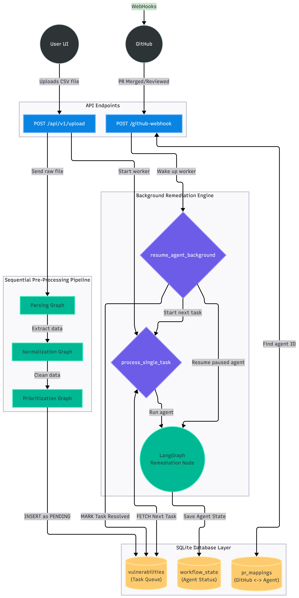

# 🛡️ Zero-Touch Vulnerability Remediation (ZTVR)

## 📖 Overview

Zero-Touch Vulnerability Remediation (ZTVR) is a state-of-the-art, AI-driven platform designed to automate the end-to-end vulnerability management lifecycle. By leveraging Large Language Models (LLMs) and advanced agentic workflows via **LangGraph**, ZTVR seamlessly connects security scanning to remediation, minimizing manual intervention and reducing mean time to remediation (MTTR).

## ✨ Key Features

The core of ZTVR is a robust multi-agent system. Each agent handles a specific node in the remediation pipeline:
- **🔍 Parsing Agent:** Ingests, normalizes, and standardizes raw output from various security scanners (e.g., Trivy, Grype).
- **🏢 Asset Criticality Agent:** Determines the business context, deployment environment, and overall criticality of the affected assets.
- **🧠 Vulnerability Intelligence Agent:** Gathers deep context, threat intel, and exploitability metrics (e.g., EPSS, CISA KEV) for specific CVEs.
- **⚖️ Prioritization Agent:** Analyzes intelligence and asset criticality to accurately score and rank vulnerabilities.
- **🛠️ Remediation Agent:** Generates actionable, code-level or configuration-level fix recommendations.
- **🎫 Jira Workflow Manager:** Automatically provisions, updates, and tracks remediation tickets directly within Jira.

## 🛠️ Tech Stack

- **Frontend:** Next.js 15, React, Tailwind CSS
- **Backend:** Python 3.11+, FastAPI
- **AI Orchestration:** LangGraph, LLMs (OpenAI/Anthropic)
- **Database:** Supabase (PostgreSQL)



## 📋 Prerequisites

Before setting up the project locally, ensure you have the following installed:
- **Node.js** (v18 or higher recommended)
- **Python** (3.13+)
- **ngrok**

**Required API Keys:**
- LLM Provider API Key (e.g., `OPENAI_API_KEY` )
- Jira API Credentials
- PostgreSQL DB URL

## 🚀 Setup & Installation

### 1. Clone the Repository
```bash
git clone https://github.com/Rahul-Data-Scientist/Zero-Touch-Vulnerability-Remediation
cd zero-touch-vulnerability-remediation
```
### 2. Backend Setup
```Bash
cd backend
```

Create and activate a virtual environment
```
python -m venv venv
```
On Mac/LinuxOS
```
source venv/bin/activate
```

On Windows use:
```
.venv\Scripts\activate
```

Install required Python packages
```
pip install -r requirements.txt
```

Configure environment variables
```
cp .env.example .env
```

Edit .env with your API keys, credentials, and Jira config

Run database migrations to set up schema
```
python lib/migrate.py
```

Start the backend server
```
uvicorn main:app 
```

# 3. Expose Backend with ngrok (Port 8000)
To expose your local backend securely to the internet (useful for webhooks or external API testing):

``` Bash
# 1. Install ngrok (if not already installed)
# macOS: brew install ngrok/ngrok/ngrok
# Linux: sudo apt install ngrok
# Windows: choco install ngrok

# 2. Authenticate (replace with your actual token from dashboard.ngrok.com)
ngrok config add-authtoken <YOUR_AUTHTOKEN>

# 3. Run ngrok on port 8000
ngrok http 8000
```
_Note: Once running, your terminal will display an active session. Copy the Forwarding URL (e.g., ```https://<random-string>.ngrok-free.app```) to use as your public-facing endpoint._

4. Frontend Setup
```Bash
# Open a new terminal and navigate to the frontend directory
cd frontend
```
```
# Install Node modules
npm install
```
```
# Start the Next.js development server
npm run dev
```

## 📁 Project Structure
```Plaintext
zero-touch-vulnerability-remediation/
├── backend/                # Python backend (FastAPI + LangGraph)
│   ├── agents/             # Multi-agent logic (Parsing, Intel, Remediation, etc.)
│   ├── lib/                # Database migrations and utilities
│   ├── main.py             # FastAPI entry point
│   ├── app.py              # Application routing and setup
│   └── requirements.txt    # Python dependencies
├── frontend/               # Next.js 15 Web Application
│   ├── app/                # Next.js App Router (pages & layouts)
│   ├── components/         # Reusable React/Tailwind UI components
│   └── package.json        # Node dependencies
├── test/                   # Sample payloads for testing
│   ├── scanner1_trivy_filtered.json
│   └── scanner2_grype_filtered.json
└── flow.png                # System Architecture Diagram
```

## 🧪 Testing
You can test the agentic pipeline locally without running a live container scan. Simply navigate to the test/ directory, which contains pre-filtered sample payloads:

``` scanner1_trivy_filtered.json ```

``` scanner2_grype_filtered.json ```

Submit these JSON files via the frontend UI or directly to the backend API to trigger the LangGraph orchestration and watch the agents process, prioritize, and remediate the vulnerabilities.

## 🤝 Contributing
Contributions are what make the open-source community such an amazing place to learn, inspire, and create. Any contributions you make are greatly appreciated.

Fork the Project

Create your Feature Branch (```git checkout -b feature/AmazingFeature```)

Commit your Changes (```git commit -m 'Add some AmazingFeature'```)

Push to the Branch (```git push origin feature/AmazingFeature```)

Open a Pull Request


## 👨‍💻 Contributors
<a href="https://github.com/rahul-data-scientist/zero-touch-vulnerability-remediation/graphs/contributors">
  
</a>
